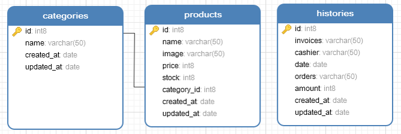

# Restaurant Backend
Tes
## Technology
`Node JS`
`Express JS`
`PostgreSQL`
`ValidatorJS`

## How to Install
```
git clone https://github.com/arifh19/restaurant-backend.git
cd restaurant-backend
npm install
```

## Run
```
npm start
```
## Database



## APIs
| Method | Endpoint | Description |
| --- | --- | --- |
| GET | /category | List of category  |
| POST | /category | Create new category  |
| PUT | /category | Update a category  |
| DELETE | /category | Delete a category  |
| GET | /product | List of product  |
| GET | /product?column=name&sort=asc | Sort product by  |
| GET | /product/search/:name | Search product by name  |
| POST | /product | Create new product  |
| PUT | /product | Update a product  |
| DELETE | /product | Delete a product  |
| GET | /history | List of history  |
| POST | /history | Create new history  |
| PUT | /history | Update a history  |
| DELETE | /history | Delete a history  |


## Contribute
Just make pull request to contribute. 
